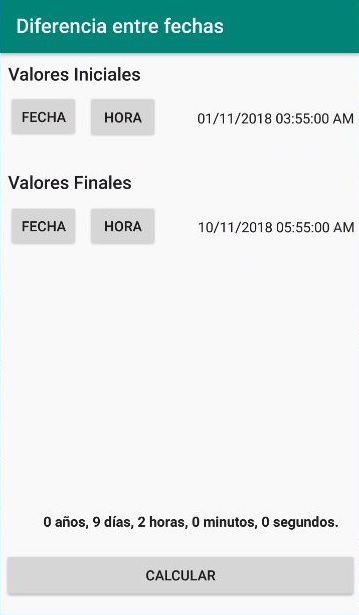

# Calculadora de Tiempo

Aplicación Android que muestra el tiempo transcurrido entre dos fechas en formato humano, como por ejemplo, "1 año, 2 días, 3 horas, 20 minutos, 30 segundos. También posee la opción de comparar con la fecha del momento.

### Demo

Diferencia entre dos fechas

Compara momento exacto

### Creado y Mantenido por
[Javier Bello](https://github.com/JavierBelloRD)([@JavierBelloRD1](https://www.twitter.com/JavierBelloRD1))

> NOTA: Soy un estudiante de Altice Academy, acutualmente estoy concluyendo el curso Basico de Android. Este proyecto representa la puesta en practica de todo el conociento adquirido durante todo el curso.
